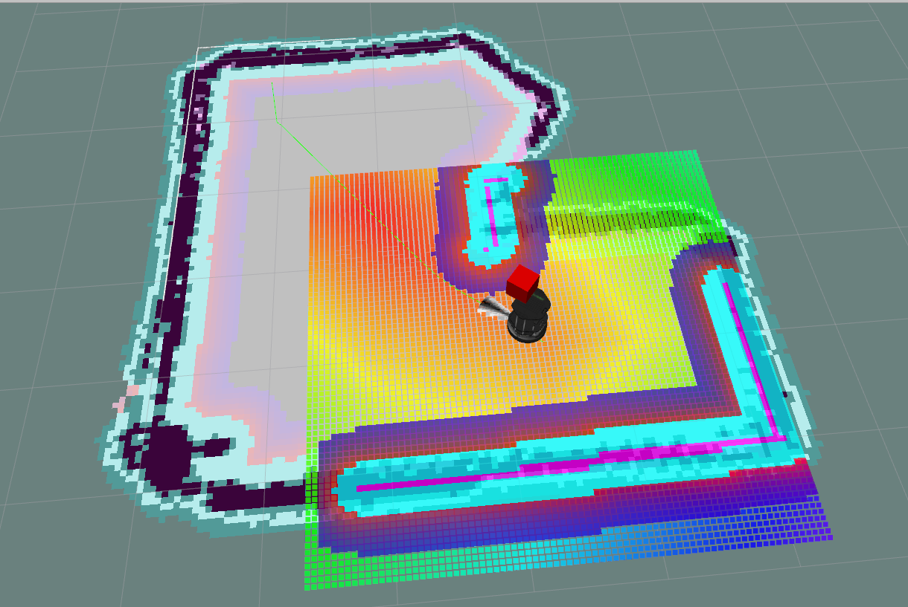

# RoboND2_Proj5_HomeServiceRobot 
ChrisL 2019-03-24

This repo is for personal coursework.<br/>
It is for the "Home Service Robot" ROS Slam Project, 
the fifth and last project of Udacity Robotic Engineer ND, Term2.

## Submission notes
NOTE: This repo contains more than just the Catkin source directory!
The ROS source directory is <br>
$REPO/catkin_ws/src
It is unclear if the ROS source packages should be included in this repo or not.
I have decided to include them directly, not as git sub modules.

<br/>


[gif Video](./Assets/HomeServiceRobot.gif)<br/>


## USAGE:

### Environment & Dependency Setup
My project was developed on a personal laptop with Mint/Ubuntu16.04 with ROS Kinetic installed,
but was also tested on the udacity workspace.

The project requires several ROS packages to build and function properly.
The instructions for called for the package sources to be installed directly
within the project source folder. The exact steps to achieve this were
unclear. I believe that the following is sufficient to install the dependencies.

```
cd ~/catkin_ws/src
git clone https://github.com/turtlebot/turtlebot_simulator
git clone https://github.com/turtlebot/turtlebot_interactions
git clone https://github.com/turtlebot/turtlebot

git clone https://github.com/ros-perception/slam_gmapping
git clone https://github.com/ros-perception/openslam_gmapping

sudo apt-get install ros-kinetic-turtlebot-navigation
```

However, this repo has included those repos directly, not as submodules
so that if you clone the repo it should be ready for catkin_make.

### Runtime Debugging and Utilities
``rosrun tf view_frames`` writes the ROS transform frames to ./frames.pdf.<br>
``rosrun tf tf_monitor frame_1 frame_2`` monitors transforms.<br>
``rqt_graph`` Displays the ros nodes and topics.<br>
``roswtf`` Runs helpful diagnostics on the running ROS environment.<br>
``rtabmap-databaseViewer ./rtabmap.db`` Loads a rtabmap database file for review.<br>
``rostopic hz /rtabmap/odom`` Reports the update rate of a topic.<br>
``rqt_console`` Reports log and error messages. <br>
``rqt_image_view`` A tool to view image topics, such as from the camera.<br>
``rosrun map_server map_saver -f src/World/MyWorldMap`` Save SLAM map state.


## Links
Submission Requirements: [Rubric](https://review.udacity.com/#!/rubrics/1442/view)
My Project repo: [Rubric](https://github.com/cielsys/RoboND2_Proj5_HomeServiceRobot)
